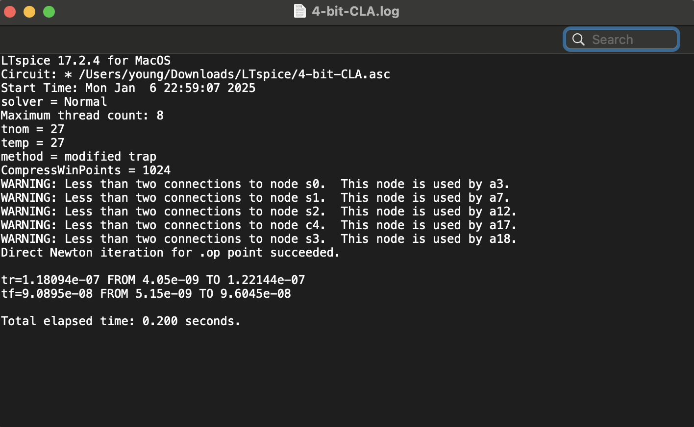

# LTspice-4-bit-Carry-Lookahead-Adder

  
  
  

This project contains the implementation of a 4-bit Carry Lookahead Adder (CLA) using LTspice. The files included are:

- `4-bit-CLA.asc`: The schematic diagram of the logic gates.
- `4-bit-CLA.plt`: The simulation waveform plot.
- `4-bit-CLA.log`: The log file of the simulation.

## Files

- **4-bit-CLA.asc**: This file contains the schematic diagram of the 4-bit CLA, showing the arrangement of the logic gates.
- **4-bit-CLA.plt**: This file contains the simulation waveform plot, illustrating the behavior of the 4-bit CLA during simulation.
- **4-bit-CLA.log**: This file contains the log of the simulation, providing detailed information about the simulation process and results.

## Usage

To simulate the 4-bit CLA, open the `4-bit-CLA.asc` file in LTspice and run the simulation. The results can be viewed in the `4-bit-CLA.plt` file, and detailed information can be found in the `4-bit-CLA.log` file.